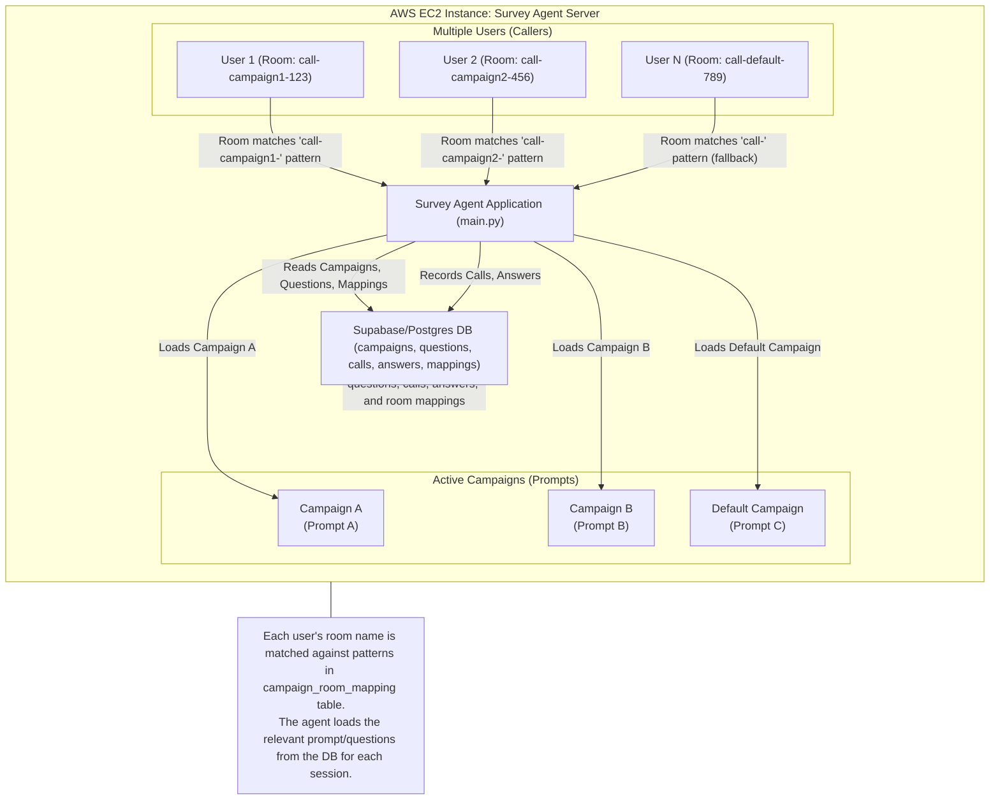

# deploy AWS or Digital Ocean

```sh
# install Docker:
sudo apt update && sudo apt install -y docker.io
sudo usermod -aG docker $USER
newgrp docker

git clone https://github.com/fbellame/futures_survey.git

cd futures_survey

git checkout sql-storage

nano .env
#copier coller les variables d'env

# build and run docker image future-survey
docker build -t future-survey .

docker run -p 8081:8081 --env-file .env future-survey
```

# Multi-Campaign Survey Agent Architecture

This project allows you to deploy a survey agent on an AWS EC2 instance that can serve multiple users, each participating in different campaigns (with different prompts and questions). The agent dynamically loads the relevant campaign and questions for each user session based on the room name, and stores all call and answer data in a central database (Supabase/Postgres).

## How It Works
- **Multiple users** can call in simultaneously.
- Each user is routed to the correct campaign (prompt) based on the room name pattern.
- The agent loads the relevant prompt/questions from the database for each session.
- All call records and answers are stored in the database, which holds all campaign/question data.

## Campaign Selection by Room Name

The system now supports campaign selection based on room name patterns:

1. **Room Name Patterns**: You can map specific room name patterns to campaigns
   - Example: `call-campaign1-` → Campaign A
   - Example: `call-campaign2-` → Campaign B
   - Example: `call-` → Default Campaign (fallback)

2. **Fallback Mechanism**: If no specific pattern matches, the system falls back to the most recent campaign.

## Setup Instructions

### 1. Database Schema
Run the updated schema in `supabase_schema_fixed.sql` which includes:
- New `campaign_room_mapping` table for mapping room patterns to campaigns
- Updated `call` table with `room_name` field for better tracking

### 2. Campaign Room Mappings
Use the setup script to create mappings:

```bash
python setup_campaign_mappings.py
```

This script allows you to:
- List all available campaigns
- Set up default mappings
- Create custom room pattern mappings

### 3. Example Room Name Patterns
- `call-` → Default campaign (fallback)
- `call-campaign1-` → Campaign 1
- `call-campaign2-` → Campaign 2
- `call-survey-a-` → Survey A Campaign

## Architecture Diagram



## Database Schema Changes

The updated schema includes:

1. **campaign_room_mapping** table:
   - Maps room name patterns to specific campaigns
   - Supports active/inactive mappings
   - Enables flexible routing

2. **call** table updates:
   - Added `room_name` field for tracking
   - Better call history and analytics

## Usage Examples

### Creating Multiple Campaigns
```python
# Create different campaigns
campaign1_id = create_campaign(
    name="Customer Satisfaction Survey",
    intro_prompt="You are conducting a customer satisfaction survey...",
    greeting="Hello, thank you for participating in our customer survey."
)

campaign2_id = create_campaign(
    name="Product Feedback Survey", 
    intro_prompt="You are conducting a product feedback survey...",
    greeting="Hello, thank you for providing product feedback."
)
```

### Setting Up Room Mappings
```python
# Map room patterns to campaigns
create_campaign_room_mapping(campaign1_id, "call-satisfaction-")
create_campaign_room_mapping(campaign2_id, "call-feedback-")
create_campaign_room_mapping(default_campaign_id, "call-")  # fallback
```

---

For more details, see the code in `main.py`, the database schema in `supabase_schema_fixed.sql`, and the setup script `setup_campaign_mappings.py`.
